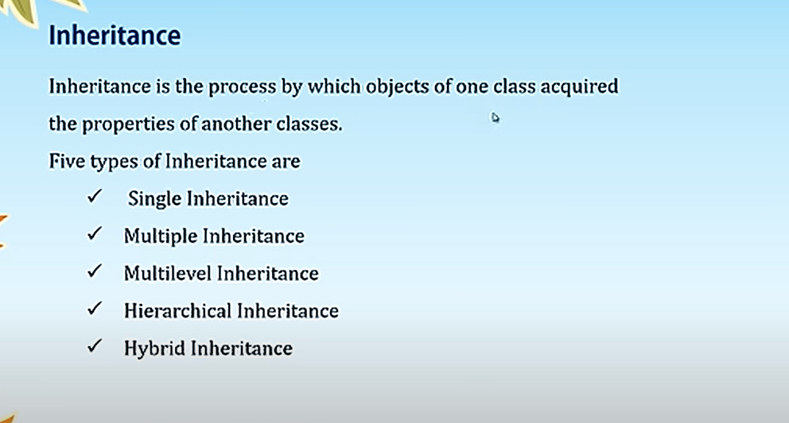
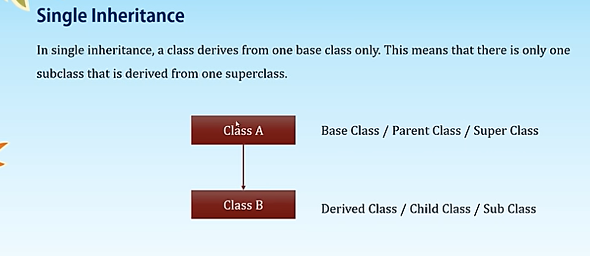
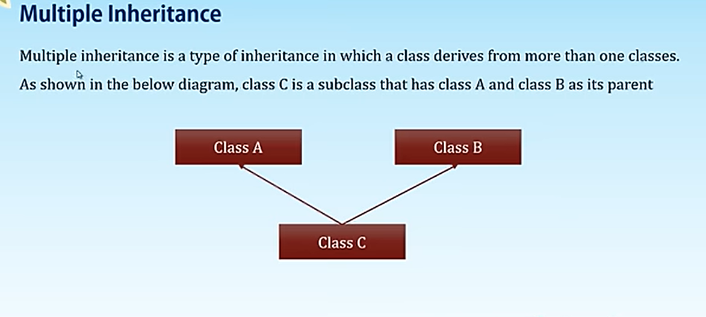
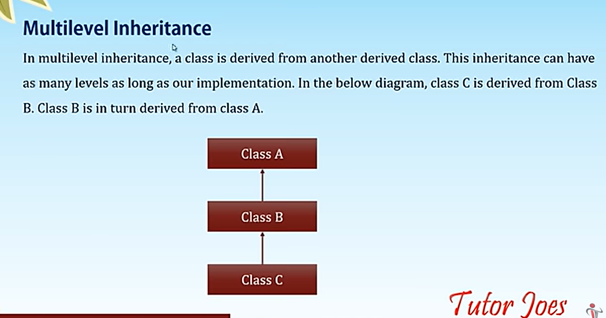
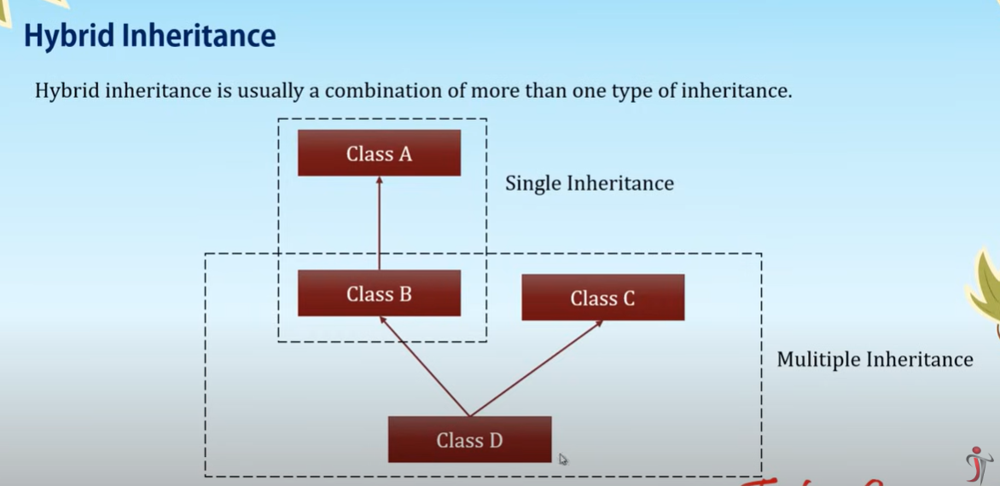
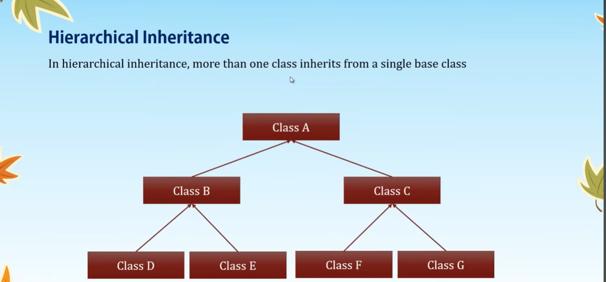
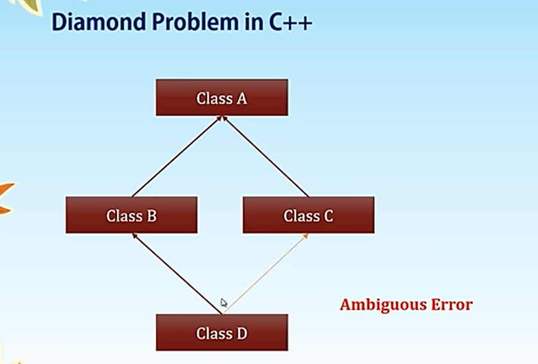
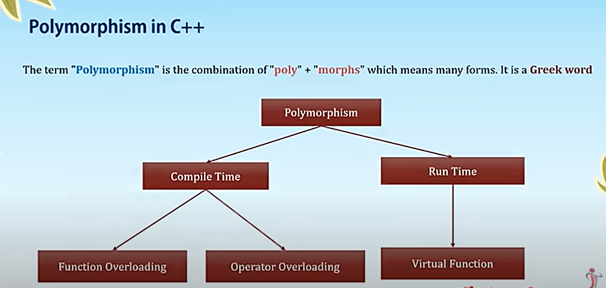
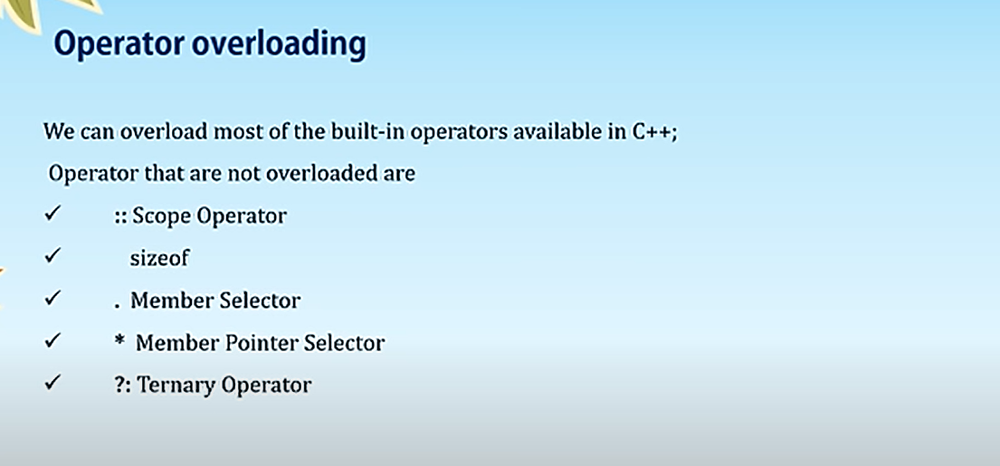

# In this repo you will learn the basics  of C++
* Prerequisite - Learn C language - [link](https://github.com/ShdwDevv/C_Program/tree/main/Notes)
* Cheat sheet - [Click here](https://whimsical.com/object-oriented-programming-cheatsheet-by-love-babbar-YbSgLatbWQ4R5paV7EgqFw)
* Course - [Click Here](https://www.scaler.com/topics/course/cpp-beginners/)
* STL - [Click Here](https://www.youtube.com/watch?v=RRVYpIET_RU)
## Normal instruction
* To compile cpp file (It will create a file named "a.out")
```shell
g++ fname.cpp
```
* To run
```shell
./a.out
```
* To runn in windows 
```shell
a.exe
```
## Hello World
* cout - console output
* << insertion operator
```cpp
#include <iostream>
using namespace std;
int main(){
    cout<<"Hello World";
    return 0;
}
```
## Use of namespace std in c++
* :: is scope resolution operator
### Without namespace
* Here we need to  use std namespace (To use the method from iostream we need to  use std::)
```c++
#include <iostream>
int main(){
    int a;
    std::cout<<"Enter A : ";
    std::cin>>a;
    std::cout<<"A value is : "<<a;
    return 0;
}
```
* In large code it will be more , So that we are using the std namespace , and oterh way to import only cin , cout
```c++
#include <iostream>
using std::cin,std::cout;
int main(){
    int a;
    cout<<"Enter A : ";
    cin>>a;
    cout<<"A value is : "<<a;
    return 0;
}
```
### Why we use namespace - to avoid name conflict 
* string is from std namespace
```cpp
#include <iostream>
using namespace std;
namespace name1{
    string name = "Arshath";
    int age = 25;
}
namespace name2{
    string name = "Arshath";
}
using namespace name2;
int main(){
    int a;
    cout<<name1::name<<endl;
    cout<<name1::age<<endl;
    cout<<name<<endl;
    return 0;
}
```
```
Arshath
25
Arshath
```
## To get user Input
* ">>" - Extraction operator
```c++
#include <iostream>
using namespace std;
int main(){
    int a,b;
    cout<<"Enter A and B : ";
    cin>>a>>b;
    cout<<"A and B are : "<<a<<" "<<b<<endl;
    return 0;
}
```
```
Enter A and B : 12 42
A and B are : 12 42
```
### With different Datatypes
```c++
#include <iostream>
using namespace std;
int main(){
    int a;
    cout<<"Enter Integer : ";
    cin>>a;
    string b;
    cout<<"Enter String : ";
    cin>>b;
    char c;
    cout<<"Enter Character : ";
    cin>>c;
    float d;
    cout<<"Enter Float : ";
    cin>>d;
    cout<<"The values are .. "<<a<<" "<<b<<" "<<c<<" "<<d<<" "<<endl;
}
```
```
Enter Integer : 22
Enter String : Sana
Enter Character : D
Enter Float : 44.4
The values are .. 22 Sana D 44.4 
```
### String Issue
* Like C, It won't consider the values after space
```c++
#include <iostream>
using namespace std;
int main(){
    string s,s2,s3;
    cout<<"Enter string : ";
    cin>>s;
    cin>>s2;
    cin>>s3;
    cout<<s<<" "<<s2<<" "<<s3<<endl;
}
```
```
Enter string : Arshath is Good
Arshath is Good
```
* To rectify this , we use getline function 
* syntax : getline(input stream, variable name)
```c++
#include <iostream>
using namespace std;
int main(){
    string s;
    cout<<"Enter Para : ";
    getline(cin,s);
    cout<<s<<endl;
}
```
```
Enter Para : c++ is good to learn 
c++ is good to learn
```
## std::string class in C++
1. Input function
1. Capacity function
1. Iterator function
1. Manipulating function
```c++
#include <iostream>
using namespace std;
int main(){
    string s = "Welcome"; // Welcome
    cout<<s<<endl;
    // since string is a class we can initialize it by creating a object
    string s2("welcome");
    cout<<s2<<endl; // welcome
    // concatenation
    string fname = "Arshath";
    string lname = "Ahamed";
    cout<<fname+" "+lname<<endl; // Arshath Ahamed
    string fullName = fname.append(" ").append(lname);
    cout<<fullName<<endl;// Arshath Ahamed
    cout<<2+" "+4<<endl; // empty space
    // Accessing
    cout<<fullName[0]<<endl; // A
    fullName[0] = 'a';
    cout<<fullName<<endl; // arshath Ahamed
} 
```
* Input function : we use getline() . If we get any issue related to getting input in string / char , use **fflush(stdin)** to delete the garbage value 
```c++
#include <iostream>
using namespace std;
int main(){
    string s = "stack";
    //to add at last
    s.push_back('s');
    cout<<s<<endl; // stacks
    // To delete from last
    s.pop_back();
    cout<<s<<endl; // staack
    return 0;
}
```
### Capacity Function  
* we can use both <= and != in for loop 
```c++
#include <iostream>
using namespace std;
int main(){
    string s("stack");
    cout<<s<<endl;
    cout<<"Size : "<<s.size()<<endl;
    cout<<"Length : "<<s.length()<<endl;
    cout<<"Max Size : "<<s.max_size()<<endl;
}
```
```
stack
Size : 5
Length : 5
Max Size : 4611686018427387903
```
### Iterator Function
```c++
#include <iostream>
using namespace std;
int main(){
    string s("stack");
    string::iterator it;
    for(it = s.begin() ; it <= s.end();it++) cout<<*it<<endl;
    // for reverse
    string::reverse_iterator it2;
    for(it2 = s.rbegin();it2 != s.rend();it2++) cout<<*it2<<endl;
}
```
### Manipulating Function
```c++
#include <iostream>
using namespace std;
int main(){
    string s1 = "adb";
    string s2 = "bad";
    cout<<"String 1 : "<<s1<<endl;
    cout<<"String 2 : "<<s2<<endl;
    s1.swap(s2);
    cout<<"After Swapping..."<<endl;
    cout<<"String 1 : "<<s1<<endl;
    cout<<"String 2 : "<<s2<<endl;
}
```
```
String 1 : adb
String 2 : bad
After Swapping...
String 1 : bad
String 2 : adb
```
## If statement
```c++
#include <iostream>
using namespace std;
int main(){
    int a,b;
    cout<<"Enter A and B : ";
    cin>>a>>b;
    if(a > b) cout<<a<<" is Greater";
    if(b > a) cout<<b<<" is Greater";
    if(a == b) cout<<"Both "<<a<<" and "<<b<<" are equal";
    return 0;
}
```
## If and else Statement
```c++
#include <iostream>
using namespace std;
int main(){
    char c;
    cout<<"Enter a Character : ";
    cin>>c;
    if(
        c == 'a' || c == 'e' || c == 'i' || c == 'o' || c == 'u' ||
        c == 'A' || c == 'E' || c == 'I' || c == 'O' || c == 'U'
    ){
        cout<<c<<" is a vowel";
    }
    else{
        cout<<c<<" is not a vowel";
    }
    return 0;
}
```
## else if statement
```
Else If Ladder in C++ :
 
A certain grade of steel is graded according to the following conditions:
 
1. Hardness must be greater than 50.
2. Carbon content must be less than 0.7
3. Tensile strength must be greater than 5600
 
The grades are as follows:
 
Grade is 10, if all three conditions are met.
Grade is 9, if conditions 1 and 2 are met.
Grade is 8, if conditions 2 and 3 are met.
Grade is 7, if conditions 1 and 3 are met.
Grade is 6, if only one condition is met.
Grade is 5, if none of the conditions are met.
```
```c++
#include <iostream>
using namespace std;
int main(){
    int hard,tensile;
    float carbon;
    cout<<"Enter Hardness : ";
    cin>>hard;
    cout<<"Enter Carbon content rate : ";
    cin>>carbon;
    cout<<"Enter Tensile strength : ";
    cin>>tensile;
    if(hard > 50 && carbon < 0.7 && tensile > 5600) cout<<"Grade is 10"<<endl;
    else if(hard > 50 && carbon < 0.7) cout<<"Grade is 9"<<endl;
    else if(carbon < 0.7 && tensile > 5600) cout<<"Grade is 8"<<endl;
    else if(hard > 50 && tensile > 5600) cout<<"Grade is 7"<<endl;
    else if(hard > 50 || carbon < 0.7 || tensile > 5600) cout<<"Grade is 6"<<endl;
    else cout<<"Grade is 5"<<endl;
    return 0;
}
```
## Nested if in C++
```
age>=18:
    Male:
        Room-5
    Female:
        Room-6
Not Eligible
```
```c++
#include <iostream>
using namespace std;
int main(){
    int age;
    cout<<"Enter Age : ";
    cin>>age;
    if(age >= 18){
        char gender;
        cout<<"Enter Gender : ";
        cin>>gender; // here if we give 'ma' then it  will  consider the first character only and make the gender male
        if(gender == 'M' || gender == 'm') cout<<"Go to room 5"<<endl;
        else if(gender == 'F' || gender == 'f') cout<<"Go to room 6"<<endl;
        else cout<<"Invalid Gender"<<endl;
    }
    else{
        cout<<"You are not eligible for the vote"<<endl;
    }
    return 0;
}
```
## Switch Statement
```c++
#include <iostream> 
using namespace std;
int main(){
    int m;
    cout<<"Enter Month Count : ";
    cin>>m;
    switch(m){
        case 1:cout<<"January"<<endl;break;
        case 2:cout<<"February"<<endl;break;
        case 3:cout<<"March"<<endl;break;
        case 4:cout<<"April"<<endl;break;
        case 5:cout<<"May"<<endl;break;
        case 6:cout<<"June"<<endl;break;
        case 7:cout<<"July"<<endl;break;
        case 8:cout<<"August"<<endl;break;
        case 9:cout<<"September"<<endl;break;
        case 10:cout<<"October"<<endl;break;
        case 11:cout<<"November"<<endl;break;
        case 12:cout<<"December"<<endl;break;
        default : cout<<"Invalid Month"<<endl;
    }
}
```
## Group Switch Statement
* we need to print the number of days in thhe respective month
```c++
#include <iostream> 
using namespace std;
int main(){
    int m;
    cout<<"Enter Month Count : ";
    cin>>m;
    switch(m){
        case 1:case 3:case 5:case 7:case 8:case 10:case 12:cout<<"31 Days"<<endl;break;
        case 4:case 6:case 9:case 11:cout<<"30 Days"<<endl;break;
        case 2:cout<<"28/29 Days"<<endl;break;
        default : cout<<"Invalid Month"<<endl;
    }
}
```
## Salary calculation using if statement
```
If his basic salary is less than Rs. 1500,
then HRA = 10% of basic salary and DA = 90% of basic salary.
If his salary is either equal to or above Rs. 1500,
then HRA = Rs. 500 and DA = 98% of basic salary.
If the employee's salary is input through the keyboard
write a program to find his gross salary
```
```c++
#include<iostream>
using namespace std;
int main(){
    float bs,gs,hra,da;
    cout<<"Enter Basic Salary : ";
    cin>>bs;
    if(bs < 1500){
        hra = bs * 10 / 100;
        da = bs * 90 / 100;
    }
    else{
        hra = 500;
        da = bs * 98 / 100;
    }
    gs = bs + hra + da;
    cout<<"Basic Salary         : "<<bs<<endl;
    cout<<"House Rent Allowance : "<<hra<<endl;
    cout<<"Dearness Allowance   : "<<da<<endl;
    cout<<"Gross Salary         : "<<gs<<endl;
    return 0;
}
```
```
Enter Basic Salary : 1000
Basic Salary         : 1000
House Rent Allowance : 100
Dearness Allowance   : 900
Gross Salary         : 2000
```
## Insurance Eligibility Test
```
A company insures its drivers in the following cases:
    a.	If the driver is married.
    b.	If the driver is unmarried, male & above 30 years of age.
    c.	If the driver is unmarried, female & above 25 years of age.
```
```c++
#include <iostream>
using namespace std;
int main(){
    char marital,gender;
    int age;
    cout<<"Enter Marital Status (M as Married | U as Unmarried) : ";
    cin>>marital;
    if(marital == 'M' || marital == 'm'){
        cout<<"You are eligible";
    }
    else if(marital == 'U' || marital == 'u'){
        cout<<"Enter The Gender (M for Male and F for Female) : ";
        cin>>gender;
        cout<<"Enter Your Age : ";
        cin>>age;
        if((gender == 'M' || gender == 'm')){
            if(age >= 30){
                cout<<"You are eligible";
            }
            else{
                cout<<"You are not eligible";
            }
        }
        else if((gender == 'F' || gender == 'f')){
            if(age >= 25){
                cout<<"You are eligible";
            }
            else{
                cout<<"You are not eligible";
            }
        }
        else{
            cout<<"Invalid Gender Input";
        }
    }
    else{
        cout<<"Invalid Marital Input";
    }
    return 0;
}
```
```
Enter Marital Status (M as Married | U as Unmarried) : U
Enter The Gender (M for Male and F for Female) : f
Enter Your Age : 28
You are eligible
```
## Library Fine Calculation
```
A library charges a fine for every book returned late.
For first 5 days the fine is 50 paise,
for 6-10 days fine is one rupee and
above 10 days fine is 5 rupees.
If you return the book after 30 days your membership will be cancelled.
Write a program to accept the number of days the member is late to return
the book and display the fine or the appropriate message.
 
>0 <=5  /0.50
>=6 <=10  /1
>10 <=30 /5
>30
```
```cpp
#include <iostream>
using namespace std;
int main(){
    int days=-1;
    while(days < 0){
        cout<<"Enter the No of Days : ";
        cin>>days;
    }
    if(days > 0 && days <= 5){
        cout<<"Per Day Fine Amount is : 50 paise"<<endl;
        cout<<"The fine amount is : "<<days*0.5;
    }
    else if(days <= 10){
        cout<<"Per Day Fine Amount is : 1 rupee"<<endl;
        cout<<"The fine amount is : "<<days*1;
    }
    else if(days <= 30){
        cout<<"Per Day Fine Amount is : 5 rupee"<<endl;
        cout<<"The fine amount is : "<<days*5;
    }
    else{
        cout<<"Your membership is cancelled";
    }
    return 0;
}
```
## While Loop
```cpp
#include <iostream>
using namespace std;
int main(){
    int i = 1,limit;
    cout<<"Enter the limit : ";
    cin>>limit;
    while(i <= limit){
        cout<<i<<endl;
        i++;
    }
}
```
## Do - While loop
```cpp
#include <iostream>
using namespace std;
int main(){
    int limit;
    cout<<"Enter the limits : ";
    cin>>limit;
    int i = 1;
    do{
        if(i % 2 == 0) cout<<i<<endl;
        i++;
    }while(i <= limit);
}
```
## For loop
```cpp
#include <iostream>
using namespace std;
int main(){
    int t;
    cout<<"Enter Table Name : ";
    cin>>t;
    for(int i = 1; i <= 10;i++){
        cout<<t<<" * "<<i<<" = "<<t*i<<endl;
    }
    return 0;
}
```
## For Each Loop
* auto means that it will automatically adaped the the element's datatype
```cpp
#include <iostream>
using namespace std;
int main(){
    int arr[] = {33,21,45,66,23,77};
    for(auto a : arr){
        cout<<a<<endl;
    }
}
```
## Sum of N number
```cpp
#include <iostream>
using namespace std;
int main(){
    int r;
    cout<<"Enter Range : ";
    cin>>r;
    int sum = 0;
    for(int i = 0 ; i <= r;i++){
        sum+=i;
    }
    cout<<"Sum of "<<r<<" numbers : "<<sum<<endl;
    cout<<"Sum of "<<r<<" numbers : "<<(r * (r+1))/2;
}
```
## Factors of a Given Number    
```cpp
#include <iostream>
using namespace std;
int main(){
    int n ; 
    cout<<"Enter the Number : ";
    cin>>n;
    cout<<"The factors of "<<n<<" are : "<<endl;
    for(int i = 1; i <= n;i++){
        if(n % i == 0) cout<<i<<" ";
    }
}
``` 
```cpp
Enter the Number : 10
The factors of 10 are :
1 2 5 10
```
### Armstrong Number between 100 and 999
Op : 153 370 371 407
```cpp
#include <iostream>
using namespace std;
int main(){
    for(int val = 100; val <= 999;val++){
        int temp = val;
        int sum = 0;
        while(temp > 0){
            int d = temp % 10;
            sum += (d * d * d);
            temp = temp / 10;
        }
        if(sum == val) cout<<sum<<" ";
    }
}
```
## Prime Number between 0 - 100
```cpp
#include <iostream>
using namespace std;
int main(){
    for(int val = 1; val <= 100;val++){
        int count = 0;
        for(int i = 1;i <= val;i++){
            if(val % i == 0) count++;
        }
        if(count == 2) cout<<val<<" ";
    }
}
```
## Arrays
```cpp
#include <iostream>
using namespace std;
int main(){
    int arr1[5] = {10,20}; // 10 20 0 0 0 
    int arr2[] = {1,2,3,4,5,6};
    for(int n : arr1) cout<<n<<" ";
    cout<<"\n";
    for(int n : arr2) cout<<n<<" ";
    cout<<"\nLength : "<<sizeof(arr2) / sizeof(int);
}
```
```
10 20 0 0 0 
1 2 3 4 5 6
Length : 6
```
## Search an element in an Array (Linear Search)
```cpp
#include <iostream>
using namespace std;
int main(){
    int n,val;
    cout<<"Enter the size of the Array : ";
    cin>>n;
    int arr[n];
    for(int i = 0;i < n;i++){
        cout<<"arr["<<i<<"] = ";
        cin>>arr[i];
    }
    cout<<"Enter the value to search : ";
    cin>>val;
    for(int i = 0; i < n;i++){
        if(arr[i] == val){
            cout<<"Value found at index "<<i;
            return 0;
        }
    }
    cout<<"Value Not found :(";
    return 0; 
}   
```
## Sum of element in an Array
```cpp
#include <iostream>
using namespace std;
int main(){
    int n;
    cout<<"Enter the size of an array : ";
    cin>>n;
    int arr[n],sum;
    for(int i = 0; i < n;i++){
        cout<<"arr["<<i<<"]"<<" = ";
        cin>>arr[i];
        sum += arr[i];
    }
    cout<<"The Sum is : "<<sum;
}
```
## Greatest Element in an Array
```cpp
#include <iostream>
using namespace std;
int main(){
    int n;
    cout<<"Enter the size of an array : ";
    cin>>n;
    int arr[n],sum;
    for(int i = 0; i < n;i++){
        cout<<"arr["<<i<<"]"<<" = ";
        cin>>arr[i];
    }
    int maxVal = arr[0];
    for(int i = 1;i < n;i++){
        if(arr[i] > maxVal) maxVal = arr[i];
    }
    cout<<"The Greater Value is : "<<maxVal;
}
```
## Sort an Element in an Array
```cpp
#include <iostream>
using namespace std;
int main(){
    int n;
    cout<<"Enter the size of an Array : ";
    cin>>n;
    int arr[n];
    for(int i = 0; i < n;i++){
        cout<<"arr["<<i<<"]"<<" = ";
        cin>>arr[i];
    }
    for(int i = 0; i < n;i++){
        for(int j = i+1;j < n;j++){
            if(arr[i] > arr[j]){
                int temp = arr[i];
                arr[i] = arr[j];
                arr[j] = temp;
            }
        }
    }
    cout<<"The Sorted array are : "<<endl;
    for(int val : arr){
        cout<<val<<" ";
    }
}
```
## Functions
```cpp
#include <iostream>
using namespace std;
void greet(){
    cout<<"Hello"<<endl;
}
int main(){
    greet();
    greet();
    greet();
    greet();
    greet();
    greet();
}
```
## function Overloading
```cpp
#include <iostream>
using namespace std;
int add(int a,int b){
    return a+b;
}
int add(int a,int b,int c){
    return a+b+c;
}
float add(float a,float b){
    return a+ b;
}

float add(float a,float b,float c){
    return a+ b+c;
}
int main(){
    cout<<add(2,3)<<endl;
    cout<<add(2,3,4)<<endl;
    cout<<add(2.3f,3.2f)<<endl;
    cout<<add(2.4f,3.2f,4.3f)<<endl;
}
```
## Default Argument Function
```cpp
#include<iostream>
using namespace std;
void display(string name = "Arshath",string city = "chennai",int age = 20){
    cout<<name<<" is from "<<city<<" and his age is "<<age<<endl;
}
int main(){
    display("sana","pakistan",22);
    display();
    display("Bakie");
}   
```
```
sana is from pakistan and his age is 22
Arshath is from chennai and his age is 20
Bakie is from chennai and his age is 20
```

## Templates in C++

* A template is a simple yet very powerful tool in C++. The simple idea is to pass the data type as a parameter so that we don’t need to write the same code for different data types. For example, a software company may need to sort() for different data types. Rather than writing and maintaining multiple codes, we can write one sort() and pass the datatype as a parameter. 
* C++ adds two new keywords to support templates: ‘template’ and ‘typename’. The second keyword can always be replaced by the keyword ‘class’.

```cpp
#include <iostream>
using namespace std;
template <class T>
void swapping(T &a,T &b){
    T temp = a;
    a = b;
    b = temp;
}
int main(){
    int a = 10;
    int b = 20;
    cout<<"Before Swapping : A = "<<a<<" B = "<<b<<endl;
    swapping(a,b);
    cout<<"After Swapping : A = "<<a<<" B = "<<b<<endl;
    char x = 'A',y = 'B';
    cout<<"Before Swapping : X = "<<x<<" Y = "<<y<<endl;
    swapping(x,y);
    cout<<"After Swapping : X = "<<x<<" Y = "<<y<<endl;
}
```
## Enum in C++
* An enum is a special type that represents a group of constants (unchangeable values).
* To create an enum, use the enum keyword, followed by the name of the enum, and separate the enum items with a comma:
```cpp
#include <iostream>
using namespace std;
enum gender {MALE,FEMALE};
int main(){
    gender g = MALE;
    switch(g){
        case MALE : cout<<"Male";break;
        case FEMALE : cout <<"Female";break;
        default : cout<<"Invalid";
    }
}
```
## Class in C++
`!!! for every end of the class we need to put semicolon`
```cpp
#include <iostream>
using namespace std;
class Circle{
    public:
        float radius;
    public:
        float area(){
            return (3.14 * radius * radius);
        }
        float circumference(){
            return (2 * 3.14 * radius);
        }
};
int main(){
    Circle c;
    c.radius = 12;
    cout<<"Area : "<<c.area()<<endl;
    cout<<"Circumference : "<<c.circumference()<<endl;
}
Area : 452.16
Circumference : 75.36
```
## Access Specifier
* In c++ there are 3 access specifier
    * public
    * private
    * protected
### public 
* The public access specifier in C++ is a keyword that defines class members that can be accessed from anywhere in the program, including external code
```cpp
#include <iostream>
using namespace std;
class student{
    public:
    string name;
    int age;
    void display(){
        cout<<"Hi "<<name<<", Your Age is "<<age;
    }
};
int main(){
    student s;
    cout<<"Enter Name : ";
    cin>>s.name;
    cout<<"Enter Age : ";
    cin>>s.age;
    s.display();
}
Enter Name : Arshath 
Enter Age : 32
Hi Arshath, Your Age is 32
```

### private
* In C++, the private access specifier limits the access to class members, making them only accessible within the class
```cpp
#include <iostream>
using namespace std;
class student{
    private:
    string name;
    int age;
    public:
    void setData(string s,int n){
        name = s;
        age = n;
    }
    void display(){
        cout<<"Hi "<<name<<", Your Age is "<<age;
    }
};
int main(){
    student s;
    string name;
    int age;
    cout<<"Enter Name : ";
    cin>>name;
    cout<<"Enter Age : ";
    cin>>age;
    s.setData(name,age);
    s.display();
}
```
## Scope Resolution Operator
* While defining the class's function outside the class , we use scope resolution operator
* syntax : 
1. declaration(inside class) : `returnType functionName();`
1. defining(outside class) : `returnType className :: functionName(){}`
```cpp
#include <iostream>
using namespace std;
class student{
    private:
    string name;
    int m1,m2,m3;
    public:
    void getData(){
        cout<<"Enter Name : ";
        cin>>name;
        cout<<"Enter 3 marks : ";
        cin>>m1>>m2>>m3;
    }
    void display();
};
void student :: display(){
    int total = m1+m2+m3;
    float avg = total / 3.0;
    cout<<"Name : "<<name<<endl;
    cout<<"Mark 1 : "<<m1<<endl;
    cout<<"Mark 2 : "<<m2<<endl;
    cout<<"Mark 3 : "<<m3<<endl;
    cout<<"Total : "<<total<<endl;
    cout<<"Average : "<<avg<<endl;
}
int main(){
    student s;
    s.getData();
    s.display();
}
Enter Name : Arshath
Enter 3 marks : 77 88 77
Name : Arshath
Mark 1 : 77
Mark 2 : 88
Mark 3 : 77
Total : 242
Average : 80.6667
```

## Constructor
* Constructors are special function named after the class and without a return type, and are used to construct objects. Constructors, like function, can take input parameters. Constructors are used to initialize objects.
* Constructors are different from function:
    * Constructors must be named the same as the class name.
    * Constructor is automatically called when object(instance of class) is created.
    * Constructors do not have a return type
* Types of constructor :
    * Default constructor
    * Parametrized constructor
    * Copy constructor
    * Constructor Overloading
### Default Constructor
```cpp
#include <iostream>
using namespace std;
class student{
    public:
    student(){
        cout<<"Object Created.."<<endl;
    }
};
int main(){
    student s1;
    student s2;
    student s3;
    student s4;
}
Output : 
Object Created..
Object Created..
Object Created..
Object Created..
```
### Parametrized Constructor
```cpp
#include <iostream>
using namespace std;
class student{
    private:
    string name;
    public:
    student(string s){
        name = s;
    }
    void display(){
        cout<<"Hi "<<name;
    }
};
int main(){
    student s("Arshath");
    s.display();
}
```
### Copy constructor
```cpp
#include <iostream>
using namespace std;
class maths{
    private:
    int a,b;
    public:
    maths(int x,int y){
        a = x;
        b = y;
    }
    maths(maths &other){
        a = other.a;
        b = other.b;
    }
    void add(){
        cout<<"Total : "<<a+b<<endl;
    }
};
int main(){
    maths o1(22,32);
    maths o2(o1);
    o1.add();
    o2.add();
}
Total : 54
Total : 54
```
## Constructor Overloading
```cpp
#include <iostream>
using namespace std;
class maths{
    private:
    int a,b;
    public:
    maths(){
        a = 0;
        b = 0;
    }
    maths(int x,int y){
        a = x;
        b = y;
    }
    maths(maths &other){
        a = other.a;
        b = other.b;
    }
    void add(){
        cout<<"Total : "<<a+b<<endl;
    }
};
int main(){
    maths o1(22,32);
    maths o2(o1);
    maths o3;
    o1.add();
    o2.add();
    o3.add();
}
Total : 54
Total : 54
Total : 0
```
## Destructor
* Destructor is an instance member function which is invoked automatically
whenever an object is going to destroy.
Means, a destructor is the last function that is going to be called before an object is destroyed.
```c++
#include <iostream>
using namespace std;
class student{
    public:
    student(){
        cout<<"Object Created"<<endl;
    }
    ~student(){
        cout<<"Objected Destructed (Memory free)"<<endl;
    }
};
int main(){
    student s;
    return 0;
}
Object Created
Objected Destructed (Memory free)
```
## Inheritance

### Single Inheritance

* syntax : `class superClassName : accessSpecifier subClassName`
```cpp
#include <iostream>
using namespace std;
class Father{
    public:
    void house(){
        cout<<"I have a House"<<endl;
    }
};
class Son : public Father{
    public:
    void car(){
        cout<<"I have a Car"<<endl;
    }
};
int main(){
    Son s;
    s.house();
    s.car();
}
```
### Multiple Inheritance

```cpp
#include <iostream>
using namespace std;
class Father{
    public:
    void fishing(){
        cout<<"Learn Fishing"<<endl;
    }
};
class Mother{
    public:
    void cooking(){
        cout<<"Learn Cooking"<<endl;
    }
};
class Son : public Father,public Mother{
    public:
    void coding(){
        cout<<"Learn Coding"<<endl;
    }
};
int main(){
    Son s;
    s.coding();
    s.cooking();
    s.fishing();
}

Learn Coding
Learn Cooking
Learn Fishing
```
* error: request for member 'a' is ambiguous
### Multilevel Inheritance

```cpp
#include <iostream>
using namespace std;
class GrandFather{
    public:
    void land(){
        cout<<"I have a Land"<<endl;
    }
};
class Father: public GrandFather{
    public:
    void house(){
        cout<<"I have a House"<<endl;
    }
};
class Son : public Father{
    public:
    void car(){
        cout<<"I have a Car"<<endl;
    }
};
int main(){
    Son s;
    s.land();
    s.house();
    s.car();
}
I have a Land
I have a House
I have a Car
```
## Hybrid Inheritance

```cpp
#include <iostream>
using namespace std;
class GrandFather{
    public:
    void land(){
        cout<<"I have a Land"<<endl;
    }
};
class Father: public GrandFather{
    public:
    void house(){
        cout<<"I have a House"<<endl;
    }
};
class Mother{
    public:
    void gold(){
        cout<<"I have a gold";
    }
};
class Son : public Father,public Mother{
    public:
    void car(){
        cout<<"I have a Car"<<endl;
    }
};
int main(){
    Son s;
    s.land();
    s.house();
    s.car();
    s.gold();
}
I have a Land
I have a House
I have a Car
I have a gold
```
## Hierarchial Inheritance

```cpp
#include <iostream>
using namespace std;
class Shape{
    public:
    float radius,length,breath,height;
};
class Triangle: public Shape{
    public:
    void getValue(){
        cout<<"Enter Breath : ";
        cin>>breath;
        cout<<"Enter Height : ";
        cin>>height;
    }
    void area(){
        cout<<"Area of Triangle: "<<0.5 * breath * height<<endl;
    }
};
class Square: public Shape{
    public:
    void getValue(){
        cout<<"Enter Side : ";
        cin>>length;
    }
    void area(){
        cout<<"Area of Square : "<<length*length<<endl;
    }
};
class Rectangle: public Shape{
    public:
    void getValue(){
        cout<<"Enter Breath : ";
        cin>>breath;
        cout<<"Enter Length : ";
        cin>>length;
    }
    void area(){
        cout<<"Area of Rectangle : "<<length*breath<<endl;
    }
};
class Circle: public Shape{
    public:
    void getValue(){
        cout<<"Enter Radius : ";
        cin>>radius;
    }
    void area(){
        cout<<"Area of Circle : "<<3.14*radius*radius<<endl;
    }
};
int main(){
    Triangle t;
    Rectangle r;
    Square s;
    Circle c;
    t.getValue();
    t.area();
    r.getValue();
    r.area();
    s.getValue();
    s.area();
    c.getValue();
    c.area();
}
```
## Diamonnd problem in C++

```cpp
#include <iostream>
using namespace std;
class A{
    public:
    int age;
};
class B:public A{

};
class C:public A{

};
class D:public B,public C{

};
int main(){
    D obj;
    obj.age = 10;
}
// main.cpp:18:9: error: request for member 'age' is ambiguous
// obj.age = 10;
```
* exapmle with constructor  (A is calling 2 times)
```cpp
#include <iostream>
using namespace std;
class A{
    public:
    A(){
        cout<<"A's Constructor"<<endl;
    }
};
class B:public A{
    public:
    B(){
        cout<<"B's Constructor"<<endl;
    }
};
class C:public A{
    public:
    C(){
        cout<<"C's Constructor"<<endl;
    }
};
class D:public B,public C{
    public:
    D(){
        cout<<"D's Constructor"<<endl;
    }
};
int main(){
    D obj;
}
A's Constructor
B's Constructor
A's Constructor
C's Constructor
D's Constructor

```

* To solve this issue we use `virtual` keyword to inherit a class
```cpp
#include <iostream>
using namespace std;
class A{
    public:
    int age;
};
class B:virtual public A{

};
class C:virtual public A{

};
class D:public B,public C{

};
int main(){
    D obj;
    obj.age = 10;
    cout<<obj.age<<endl;
}
```
```cpp
#include <iostream>
using namespace std;
class A{
    public:
    A(){
        cout<<"A's Constructor"<<endl;
    }
};
class B:virtual public A{
    public:
    B(){
        cout<<"B's Constructor"<<endl;
    }
};
class C:virtual public A{
    public:
    C(){
        cout<<"C's Constructor"<<endl;
    }
};
class D:public B,public C{
    public:
    D(){
        cout<<"D's Constructor"<<endl;
    }
};
int main(){
    D obj;
}
A's Constructor
B's Constructor
C's Constructor
D's Constructor
```
## Bank Management System using Class and Inheritance
```cpp
#include <iostream>
using namespace std;
class account{
    private:
    string name;
    int accno;
    string acctype;
    public:
    float balance = 0;
    account(string t){
        acctype = t;
    }
    void getAccountDetails(){
        cout<<"Enter Name : ";
        cin>>name;
        cout<<"Enter Account Number : ";
        cin>>accno;
    }
    void displayDetails(){
        cout<<"Name : "<<name<<endl;
        cout<<"Account Number : "<<accno<<endl;
        cout<<"Account Type : "<<acctype<<endl; 
    }
    void showBalance(){
        cout<<"Account number : "<<accno<<endl;
        cout<<"Balance : "<<balance<<endl;
    }
};
class savings : public account{
    public:
    savings(string type) : account(type){
    }
    void deposit(float depositMoney){
        float interest;
        balance += depositMoney;
        interest = ((balance * 2) / 100) ;
        balance += interest;
        cout<<"Current Balance : "<<balance<<endl;
    }
    void withdraw(float withdrawMoney){
        if(balance > 500 && balance > withdrawMoney){
            balance=balance-withdrawMoney;
            cout<<"Withdrawed : "<<withdrawMoney<<endl;
            cout<<"Balance Amount After Withdraw: "<<balance<<endl;
        }
        else{
            cout<<"Insufficient Balance"<<endl;
        }
    }
};
class current : public account{
    public:
    current(string type) : account(type){
    }
    void deposit(float depositMoney){
        balance += depositMoney;
        cout<<"Current Balance : "<<balance<<endl;
    }
    void withdraw(float withdrawMoney){
        if(balance > 1000 && balance > withdrawMoney){
            balance=balance-withdrawMoney;
            cout<<"Withdrawed : "<<withdrawMoney<<endl;
            cout<<"Balance Amount After Withdraw: "<<balance<<endl;
        }
        else{
            cout<<"Insufficient Balance"<<endl;
        }
    }
};
int main(){
    float depamt,withamt;
    char type;
    cout<<"Enter S for saving customer and C for current a/c customer : ";
    cin>>type;
    if(type == 'S' || type == 's'){
        savings ac("Savings");
        int choice;
        ac.getAccountDetails();
        while(1){
            cout<<"\nChoose Your Choice\n1)   Deposit\n2)   Withdraw\n3)   Display Balance\n4)   Display with full Details\n5)   Exit"<<endl;
            cout<<"Enter Your choice: ";
            cin>>choice;
            switch(choice){
                case 1 :
                cout<<"Enter a Money to Deposit : ";
                cin>>depamt;
                ac.deposit(depamt);
                break;
                case 2 :
                cout<<"Enter a Money to Withdraw : ";
                cin>>withamt;
                ac.withdraw(withamt);
                break;
                case 3 :
                ac.showBalance();break;
                case 4 :
                ac.displayDetails();break;
                case 5 : 
                goto end;
                default:
                cout<<"Invalid Option"<<endl;
            }
        }
    }
    else if(type == 'c' || type == 'C'){
        current ac("Savings");
        int choice;
        ac.getAccountDetails();
        while(1){
            cout<<"Choose Your Choice\n1)   Deposit\n2)   Withdraw\n3)   Display Balance\n4)   Display with full Details\n5)   Exit"<<endl;
            cout<<"Enter Your choice: ";
            cin>>choice;
            switch(choice){
                case 1 :
                cout<<"Enter a Money to Deposit : ";
                cin>>depamt;
                ac.deposit(depamt);
                break;
                case 2 :
                cout<<"Enter a Money to Withdraw : ";
                cin>>withamt;
                ac.withdraw(withamt);
                break;
                case 3 :
                ac.showBalance();break;
                case 4 :
                ac.displayDetails();break;
                case 5 : 
                goto end;
                default:
                cout<<"Invalid Option"<<endl;
            }
        }
    }
    else{
        cout<<"Invalid Account Selection";
    }
    end:
    cout<<"Thank you :)";
    return 0;
}
```
## Protected Access Specifier
* We can't access the proivae variable in the inherited class , so here we use the proteced (we can access it in the same class and inherited class)
```cpp
#include <iostream>
using namespace std;
class A{
    protected:
    int x = 10;
};
class B : public A{
    public:
    void display(){
        cout<<"X : "<<x<<endl;
    }
};
int main(){
    B b;
    b.display();
    b.x; // main.cpp:16:7: error: 'int A::x' is protected within this context
}
```

## Function Overriding
* Function overriding is a type of polymorphism in which we redefine the member function of a class which it inherited from its base class. 
```cpp
#include <iostream>
using namespace std;
class base{
    protected:
    int a,b;
    public :
    base(int x,int y){
        a = x;
        b = y;
    }
    void add(){
        cout<<"Addition : "<<a+b;
    }
};
class derived : public base{
    private:
    int c;
    public :
    derived(int x,int y,int z) : base(x,y){
        c = z;
    }
    void add(){
        cout<<"Addition : "<<a+b+c;
    }
};
int main(){
    derived d(10,20,30);
    d.add();
}
```
## Polymorphism

## Operator Overloading

```cpp
#include <iostream>
using namespace std;
class Complex{
    private:
    int real,img;
    public:
    Complex(){
        real = 0;
        img = 0;
    }
    Complex(int r,int i){
        real = r;
        img = i;
    }
    void display(){
        cout<<real<<"+"<
using namespace std;
class Box{
    private:
    int x;
    public:
    Box(){
        x = 0;
    }
    Box(int r){
        x = r;
    }
    void display(){
        cout<<"X : "<<x<<endl;
    }
    void  operator ++ (){ //pre increment
        ++x;
    }
    void operator ++ (int){ // post increment
        x++;
    }
};
int main(){
    Box b(10);
    b.display();
    // b++;//main.cpp:23:6: error: no 'operator++(int)' declared for postfix '++'
    ++b;
    b.display();
    b++;
    b.display();
}
X : 10
X : 11
X : 12
```
## Base class pointer , Derived class object
* In your code, the use of a base class pointer (Base*) pointing to a derived class object demonstrates polymorphism in C++. Polymorphism allows objects of different derived classes to be treated uniformly as objects of the base class. The purpose of this is to achieve dynamic binding or runtime polymorphism, where the specific type of the object is determined at runtime, enabling flexible and reusable code. By using a base class pointer, you can point to any derived class object, promoting extensibility and abstraction.
```cpp
#include <iostream>
using namespace std;
class Base{
    public:
    void bname(){
        cout<<"I am From Base Class"<<endl;
    }
};
class Derived : public Base{
    public:
    void dname(){
        cout<<"I am From Derived Class"<<endl;
    }
};
int main(){
    Base *b = NULL;
    Derived d;
    b = &d;
    b->bname();
}
```
## virtual Funtion
* The base class pointer derived class object does not able to access the derived object's method , so to rectify that issue , we use `virtual function` (For overriding issue)
```cpp
#include <iostream>
using namespace std;
class Base{
    public:
    virtual void name(){
        cout<<"I am From Base Class"<<endl;
    }
};
class Derived : public Base{
    public:
    void name(){
        cout<<"I am From Derived Class"<<endl;
    }
};
int main(){
    Base *b = NULL;
    Derived d;
    b = &d;
    b->name(); // I am From Derived Class
}
```
* Another Example
```cpp
#include <iostream>
using namespace std;
class vaccine{
    public:
    virtual void name(){
        cout<<"Putting Vaccine"<<endl;
    }
};
class covaccine : public vaccine{
    public:
    void name(){
        cout<<"Putting CoVaccine"<<endl;
    }
};
class covishield : public vaccine{
    public:
    void name(){
        cout<<"Putting CoviShield"<<endl;
    }
};
int main(){
    covaccine cx;
    covishield cs;
    vaccine *v = &cx;
    v->name(); // Putting CoVaccine
    v = &cs;
    v->name(); // Putting CoviShield
}
```
## Pure Virtual Function
* The method is declared in base class , and it should be defined in the derived class
* A pure virtual function is a virtual function that has no definition and must be overridden in a derived class .
```cpp
#include <iostream>
using namespace std;
class Base{
    public:
    virtual void run() = 0;
};
class Derived : public Base{
    public:
    void run(){
        cout<<"Running by derived";
    }
};
int main(){
    Base *b = new Derived();
    b->run(); // Running by derived
}
```
* Abstract class - If a class contains atleast one Pure Virtual Function the we call it as `Abstract Class`

## Abstraction
* Data abstraction is one of the most essential and important features of object-oriented programming in C++. Abstraction means displaying only essential information and ignoring the details.
```cpp
#include <iostream>
using namespace std;
class BANK{
    public:
    virtual void deposit() = 0;
    virtual void credit() = 0;
    virtual void loan() = 0;
};
class HDFC : public BANK{
    public:
    void deposit(){
        cout<<"HDFC Deposit"<<endl;
    }
    void credit(){
        cout<<"HDFC Credit"<<endl;
    }
    void loan(){
        cout<<"HDFC Loan : 15%"<<endl;
    }
};
class IOB : public BANK{
    public:
    void deposit(){
        cout<<"IOD Deposit"<<endl;
    }
    void credit(){
        cout<<"IOD Credit"<<endl;
    }
    void loan(){
        cout<<"IOD Loan : 5%"<<endl;
    }
};
int main(){
    BANK *b = new HDFC();
    b->credit(); // HDFC Credit
    b = new IOB();
    b->deposit(); // IOD Deposit
}
```
## Getters and Setters
```cpp
#include <iostream>
using namespace std;
class Student{
    private:
    string name;
    int age;
    public:
    Student(string name,int age){
        this->name = name;
        this->age = age;
    }
    void setName(string name){
        this->name = name;
    }
    string getName(){
        return this->name;
    }
    void setAge(int age){
        this->age = age;
    }
    int getAge(){
        return this->age;
    }
    void print(){
        cout<<"Name : "<<this->name<<"\nAge : "<<this->age<<endl;
    }
};
int main(){
    Student s("arshath",32);
    s.print();
    s.setName("arss");
    s.print();
    s.setAge(90);
    cout<<s.getName()<<" "<<s.getAge()<<endl;
}
```
## Static variable 
```cpp
#include <iostream>
using namespace std;
class Student{
    public:
    // static int count = 0; // error: ISO C++ forbids in-class initialization of non-const static member 'Student::count'
    static int count;
    string name;
    Student(string name){
        this->name = name;
        ++count;
    }
    static int getCount(){
        return count;
    }
};
int Student :: count = 0;
int main(){
    Student("A");
    Student("A");
    Student("A");
    cout<<Student::count<<endl; // 3
    cout<<Student::getCount()<<endl; // 3
}
```
## Friend Function
https://www.javatpoint.com/cpp-friend-function
```cpp
#include <iostream>
using namespace std;
class A{
    private:
        int a,b;
    public:
    friend void setData();
};
void setData(){
    A o;
    o.a = 10;
    o.b = 10;
    cout<<"A : "<<o.a<<"\nB : "<<o.b<<endl;
}
int main(){
    setData();
}
A : 10
B : 10
```
## Friend Class
```cpp
#include <iostream>
using namespace std;
class  B;
class A{
    private:
    int a = 90;
    friend B;
};
class B{
    public:
    A o;
    void display(){
        cout<<o.a<<endl;
    }
};
int main(){
    B o;
    o.display();
}
```
## Change Private Values Using Friend Class
```cpp
#include <iostream>
using namespace std;
class A{
    private:
    int x = 0;
    public:
    void display(){
        cout<<"X : "<<x<<endl;
    }
    friend void setData(A &o,int val);
};
void setData(A &o,int val){
    o.x = val;
}
int main(){
    A o;
    o.display();// X : 0
    setData(o,98);
    o.display();// X : 98
}
```
## Single Value Member Initializer List
```cpp
#include<iostream>
using namespace std;
class A{
    private:
    int x;
    public:
    A(int a):x(a){}
    void display(){
        cout<<"A : "<<x<<endl;
    }
};
int main(){
    A o(9);
    o.display();
}
```
## Multiple Value Member Initializer List
```cpp
#include<iostream>
using namespace std;
class A{
    private:
    int x,y;
    public:
    A(int a,int b):x(a),y(b){}
    void display(){
        cout<<"A : "<<x<<endl;
        cout<<"B : "<<y<<endl;
    }
};
int main(){
    A o(9,10);
    o.display();
}
```
## Add value to Base Class Constructor Using Member Initializer List
```cpp
#include<iostream>
using namespace std;
class A{
    private:
    int a;
    public:
    A(int x):a(x){
        cout<<"A : "<<a<<endl;
    } 
};
class B: public A{
    private:
    int b;
    public:
    B(int x,int y):A(x),b(y){
        cout<<"B : "<<b<<endl;
    }
};
int main(){
    B o(10,20);
}
```
## Initialized Const variable using Member Initializer List
* In constructor , we cant assing value to the const variable
```cpp
#include<iostream>
using namespace std;
class A{
    private:
    const int a;
    public:
    A(int x):a(x){
        // a = x; // error: assignment of read-only member 'A::a'
        cout<<"A : "<<a<<endl;
    } 
};
int main(){
    A o(10);
}
```
## Constructor’s parameter name is same as data member using Member Initializer List
```cpp
#include<iostream>
using namespace std;
class Student{
    private:
    string name;
    int age;
    public:
    Student(string name,int age):name(name),age(age){
        cout<<"Name : "<<name<<endl;
        cout<<"Age : "<<age<<endl;
    } 
};
int main(){
    Student o("Arshth",12);
}
```
## Narrowing conversion Problem in Member Initializer
* While initializing large size datatype value to the smaller size data type , there is a narrow problem occur , so use {} to display warning 
```cpp
#include<iostream>
using namespace std;
class A{
    private:
    char a;
    public:
    A(int x):a{x}{ //  warning: narrowing conversion of 'x' from 'int' to 'char' inside { } [-Wnarrowing] A(int x):a{x}{
        cout<<"A : "<<(int)a<<endl; // A : 77
    }
};
int main(){
    A o(333);
}
```
## Inline Function
* We use when we have small function definition , it will icrease the speed 
```cpp
#include<iostream>
using namespace std;
inline int cube(int a){
    return a*a*a;
}
int main(){
    cout<<"Cube : "<<cube(3)<<endl;
}
```
## Lambda Expression / Function
```cpp
#include <iostream>
using namespace std;
int main(){
    auto sum = [](int a,int b){return a+b;};
    cout<<"Sum : "<<sum(4,5)<<endl;
}
```
## Preprocessor Directive
```cpp
#include<iostream>
#define PI 3.14
#define rectangle(l,b) {l * b}
#define createString(s) #s
#define concat(a,b) a ## b
using namespace std;
int main(){
    cout<<"Circle : "<<PI*3*3<<endl;
    int area = rectangle(3,4);
    cout<<"Rectangle : "<<area<<endl;
    cout<<"New String : "<<createString(Arshath)<<endl;
    int ab = 100;
    cout<<"AB : "<<concat(a,b)<<endl;
    cout<<"__LINE__ : "<<__LINE__<<endl;
    cout<<"__FILE__ : "<<__FILE__<<endl;
    cout<<"__DATE__ : "<<__DATE__<<endl;
    cout<<"__TIME__ : "<<__TIME__<<endl;
    cout<<"__cplusplus__ : "<<__cplusplus<<endl;
}
Circle : 28.26
Rectangle : 12
New String : Arshath
AB : 100
__LINE__14
__FILE__main.cpp
__DATE__Oct 22 2024
__TIME__23:52:22
__cplusplus__201402

D:\cache\fsbkbfsfksahfjsf\New\C++\Learn>g++ main.cpp

D:\cache\fsbkbfsfksahfjsf\New\C++\Learn>a.exe
Circle : 28.26
Rectangle : 12
New String : Arshath
AB : 100
__LINE__ : 14
__FILE__ : main.cpp
__DATE__ : Oct 22 2024
__TIME__ : 23:52:36
__cplusplus__ : 201402
```
## Character Classification Functions
```cpp
#include<iostream>
#include<cctype>
using namespace std;
int main(){
    char a[6] = "R@ 1a";
    for(int i = 0; i < 5;i++){
        if(isupper(a[i])) cout<<"a["<<i<<"] is Upper"<<endl;
        if(islower(a[i])) cout<<"a["<<i<<"] is Lower"<<endl;
        if(isspace(a[i])) cout<<"a["<<i<<"] is Space"<<endl;
        if(isalnum(a[i])) cout<<"a["<<i<<"] is Alpha numeric"<<endl;
        if(isalpha(a[i])) cout<<"a["<<i<<"] is Alphabet"<<endl;
    }
}
a[0] is Upper
a[0] is Alpha numeric
a[0] is Alphabet
a[2] is Space
a[3] is Alpha numeric
a[4] is Lower
a[4] is Alpha numeric
a[4] is Alphabet
```
## rand() in cpp
```cpp
#include <iostream>
using namespace std;
void random(){
    int random;
    for(int i = 0; i < 10;i++){
        random = rand() % 10;
        cout<<random<<endl;
    }
}
int main(){
    random();
}
```
## Exception handling in C++
```cpp
#include <iostream>
using namespace std;
int main(){
    int a = 10,b = 0;
    int c = 0;
    try{
        if(b == 0) throw string("Hi");
        c = a / b;
        cout<<"Result : "<<c<<endl;
    }
    catch(int e){
        cout<<"Error of Integer"<<endl;
    }   
    catch(char e){
        cout<<"Error of Character"<<endl;
    }
    catch(float e){
        cout<<"Error of Float"<<endl;
    }
    catch(...){
        cout<<"Error of String"<<endl;
    }
}
```
## Writing a File in C++
```cpp
#include <iostream>
#include <fstream>
using namespace std;
int main(){
    // app - appennd 
    // trunc = truncate (erase everything an write in new)
    // ofstream - output file stream
    ofstream o("test.txt",ios::trunc);
    o<<"Arhath Ahamed"<<endl;
    o.close();
}
```
## Read a File in C++
```cpp
#include <iostream>
#include <fstream>
using namespace std;
int main(){
    string text;
    ifstream getFile("test.txt");
    while(getline(getFile,text)){
        cout<<text<<endl;
    }
    getFile.close();
    return 0;
}
```
## Standard Template Libraries (STL)
### Arrays
```cpp
#include <iostream>
#include <array>
using namespace std;
int main(){
    array <int,5> a = {10,20,30,40,50};
    array <int,5> b = {100,200,300,400,500};
    cout<<"Array size : "<<a.size()<<endl;
    cout<<"A : ";
    for(int x : a) cout<<x<<" ";
    cout<<endl;
    cout<<"Array element at 3rd index : "<<a.at(3)<<endl;
    cout<<"Front Element : "<<a.front()<<endl;
    cout<<"Back Element : "<<a.back()<<endl;
    cout<<"Before Swap : "<<endl;
    cout<<"A : ";
    for(int x : a) cout<<x<<" ";
    cout<<endl;
    cout<<"B : ";
    for(int x : b) cout<<x<<" ";
    cout<<endl;
    a.swap(b);
    cout<<"After Swap : "<<endl;
    cout<<"A : ";
    for(int x : a) cout<<x<<" ";
    cout<<endl;
    cout<<"B : ";
    for(int x : b) cout<<x<<" ";
    cout<<endl;
    a.fill(-1);
    cout<<"Fill : ";
    for(int x : a) cout<<x<<" ";
}
Array size : 5
A : 10 20 30 40 50
Array element at 3rd index : 40
Front Element : 10
Back Element : 50
Before Swap :
A : 10 20 30 40 50
B : 100 200 300 400 500
After Swap :
A : 100 200 300 400 500
B : 10 20 30 40 50
Fill : -1 -1 -1 -1 -1
```
### Vector
```cpp
#include<iostream>
#include<vector>
using namespace std;
int main(){
    vector<int> a;
    cout<<"Capacity : "<<a.capacity()<<endl;// 0
    a.push_back(2);
    cout<<"Capacity : "<<a.capacity()<<endl;// 1
    a.push_back(44);
    cout<<"Capacity : "<<a.capacity()<<endl;// 2
    a.push_back(88);
    cout<<"Capacity : "<<a.capacity()<<endl;// 4
    cout<<"Size : "<<a.size()<<endl;
    cout<<"Vector element at 3rd index : "<<a.at(2)<<endl;
    cout<<"Vector Front Element : "<<a.front()<<endl;
    cout<<"Vector Back Element : "<<a.back()<<endl;
    cout<<"Before Pop "<<endl;
    cout<<"A : ";
    for(int x : a) cout<<x<<" ";
    cout<<endl;
    a.pop_back();
    cout<<"After Pop "<<endl;
    cout<<"A : ";
    for(int x : a) cout<<x<<" ";
    cout<<endl;
    a.clear();
    cout<<"After Clear"<<endl;
    cout<<"Size : "<<a.size()<<endl;
    cout<<"Capacity : "<<a.capacity()<<endl;
    vector<int> b(5,10);
    cout<<"B : ";
    for(int x : b) cout<<x<<" ";
    cout<<endl;
    cout<<"copying one element from one vector to another"<<endl;
    vector<int> c(b);
    cout<<"C : ";
    for(int x : c) cout<<x<<" ";
    cout<<endl;
    for(auto i = c.begin();i != c.end();i++){
        cout<<*i<<" ";
    }
    cout<<endl;
    vector<int> e = {1,2};
    vector<int> f = {3,4};
    e.swap(f);
    for(auto i = e.begin();i != e.end();i++){
        cout<<*i<<" ";
    }
    cout<<endl;
    for(auto i = f.begin();i != f.end();i++){
        cout<<*i<<" ";
    }
    cout<<endl;
}
```
### Deque
```cpp
#include <iostream>
#include <deque>
using namespace std;
int main(){
    deque<int> d = {23};
    d.push_back(3);
    d.push_front(33);
    for(auto i = d.begin();i != d.end();i++){
        cout<<*i<<" ";
    }
    cout<<endl;
    cout<<"Empty : "<<d.empty()<<endl;
    cout<<"Size : "<<d.size()<<endl;
    cout<<"Access : "<<d.at(2)<<endl;
    cout<<"Deque Front Element : "<<d.front()<<endl;
    cout<<"Deque Back Element : "<<d.back()<<endl;
    d.pop_back();
    d.pop_front();
    for(auto i = d.begin();i != d.end();i++){
        cout<<*i<<" ";
    }
    cout<<endl;
}
```
### list
```cpp
#include<iostream>
#include<list>
using namespace std;
void print(list<int> l){
    for(int n : l){
        cout<<n<<" ";
    }
    cout<<endl;
}
int main(){
    list<int> l = {1,23,42,53,32};
    print(l);
    l.reverse();
    cout<<"Reverse : ";
    print(l);
    cout<<"Sort : ";
    l.sort();
    print(l);
    cout<<"List Front Element : "<<l.front()<<endl;
    cout<<"List Back Element : "<<l.back()<<endl;
    l.pop_front();
    l.pop_back();
    l.push_back(332);
    l.push_front(2);
    print(l);
}
1 23 42 53 32 
Reverse : 32 53 42 23 1
Sort : 1 23 32 42 53
List Front Element : 1
List Back Element : 53
2 23 32 42 332
```
### stack
````cpp
#include <iostream>
#include <stack>
using namespace std;

void print(stack<int> st){
    while (!st.empty())
    {
        cout<<st.top()<<" ";
        st.pop();
    }
    cout<<endl;
}
int main(){
    stack<int> st;
    st.push(2);
    st.push(92);
    st.push(9);
    st.push(42);
    st.push(53);
    print(st);
}
```
### queue
```cpp
#include <iostream>
#include <queue>
using namespace std;

void print(queue<int> qu){
    while (!qu.empty())
    {
        cout<<qu.front()<<" ";
        qu.pop();
    }
    cout<<endl;
}
int main(){
    queue<int> qu;
    qu.push(2);
    qu.push(92);
    qu.push(9);
    qu.push(42);
    qu.push(53);
    print(qu);
    cout<<"First Element : "<<qu.front()<<endl;
    cout<<"Last Element : "<<qu.back()<<endl;
}
```